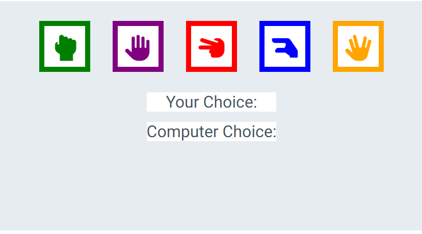

# Rock, Paper, Scissors, Lizard, Spock!

Rock, Paper, Scissors, Lizard, Spock! is a site made with javascript where a user can play a more complicated version of rock, paper, scissors vs the computer and keep track of how many wins and losses they achieve. The site is targeted at those who who want to learn about javascript and also play a game of chance vs the computer. Are you feeling lucky?

The phone in the mockup is incorrect, when i test responsiveness in browser it works with every phone

## Features 

### Existing Features

- __The Heading__

  - Featured at the top of the page, the heading is easy to see for the user. Upon viewing the page, the user will be able to see the name of the game and the choices they will be offered.

- __The Game Area__

  - This section will allow the user to play the game. The user will be able to easily see icons for rock, paper, scissors, lizard and spock.
  - The user will be able to select there choice and the computer choice will also be shown here. The computer choice is decided by a random number generator from 1 - 5 with each having a corresponding outcome. It is displayed below your choice. The buttons change when hovered over so you can easily tell which one your selecting.

- __The results section__

  - The results section is where the user will be able to see the outcome of the game, the outcomes being 'you lose', 'you win' and 'draw'.
  - The user will also be able to see how many wins and losses they have, this is all done via javascript.

### Features Left to Implement

- If i had more time i would like to implement some kind of pattern matching functionality to make the game vs the computer harder.
- id also consider changing the score system to a number of tries system before the game is over. Maybe 5 rounds.
- Also a streak counter which would keep track of the number of wins in a row and keep track of the highest streak.
- id also like to add more to the website in terms of other content however the focus is on the js code and the game itself.

## Testing 

- I have tested it works on various browsers including Chrome, safari, firefox and microsoft bing.

- I have confirmed all text and important information is contrasting and easy to read.

- I have confirmed the buttons all work as intended and produce no errors in the console when clicked, all javascript works as intended.

- I have confirmed the game still functions and looks good on smaller screens.

### Validator Testing 

- HTML
    - It comes up with repeated id's when passed through the w3c validator however this was the only fix me and 2 tutors could find over an hour plus of looking for a fix to an issue. i asked the tutor who helped me fix it if i was okay to have duplicate di tags and he said it was fine!!
- CSS
    - No errors were found when passing through the official css (Jigsaw) validator.
- JavaScript
    - No errors were found when passing through the official Jshint validator
      - The following metrics were returned: 
      - There are 5 functions in this file.
      - Function with the largest signature take 1 arguments, while the median is 0.
      - Largest function has 43 statements in it, while the median is 5.
      - The most complex function has a cyclomatic complexity value of 42 while the median is 3.

### Unfixed Bugs

Only 'bug' would be the aforementioned repeated id's, however the tutor assured me it wouldnt affect the games functionality and was okay to include. The issue that required this fix was the buttons acting weirdly. If the fontawesome icon inside the button was clicked even though its inside the button no choice was output and the console displayed errors, however the edges of the button worked correctly. We tried a lot of fixes and in the end settled on this one.   

## Deployment

The site was deployed to github pages. The steps to deploy are as follows.
In the github repository navigate to the settings tab.
From the source section dropdown menu select the master branch.
once selected the page provided the link to the completed website.

The live link can be found here - https://rhys-james29.github.io/rock-paper-scissors-lizard-spock/

## Credits 
 

- Button styling similar to the love maths example project, through mimicing the way they applied styles i learnt how to have multiple class tags that all worked together to create similar but slightly different buttons to each other without rewriting all of my css for each button.
- I found out some interesting ways to code rock paper scissors from this youtube video https://www.youtube.com/watch?v=RwFeg0cEZvQ and used what made sense to me.

